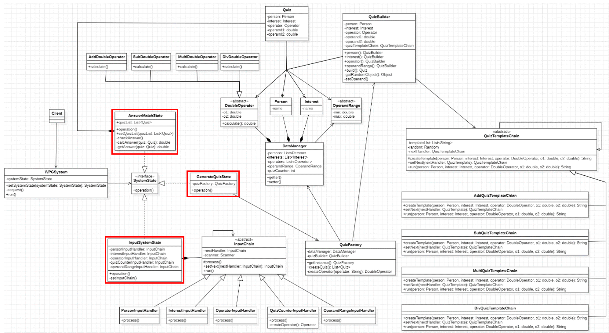
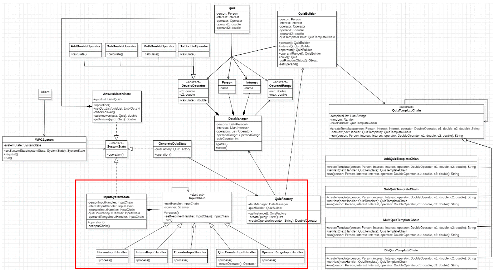
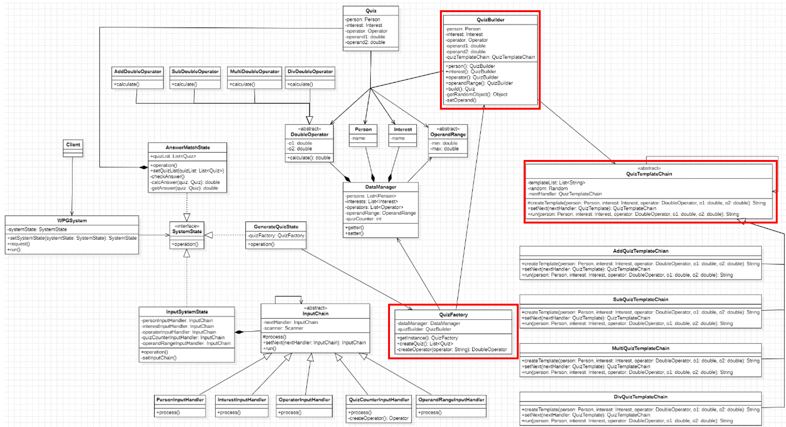
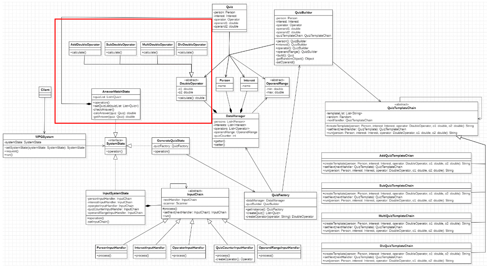

# Object-Oriented Design and Patterns_WPG project   [24-1학기 객체지향설계와패턴] 설계 프로젝트
 

 
V0

 전체 UML
 
 
 전체 시스템은 다음과 같이 총 세 단계로 나뉜다(위 그림의 붉은 상자)
 
 1.	사용자의 입력을 받고 데이터를 저장하는 단계 – InputSystemState
   
 2.	저장된 데이터로 퀴즈를 만드는 단계 - GenerateQuizState
   
 4.	사용자의 답을 입력 받아 퀴즈의 정답 유무를 판단하는 단계 - AnswerMatchState

 각 단계를 시스템의 상태로 구성할 수 있기에 상태패턴을 사용한다. 각각의 단계를 SystemState 인터페이스를 구현한   InputSystemState, GenerateQuizState, AnswerMatchState 클래스로 나타낸다. 상태패턴을 사용함으로써 시스템에 추가적인  절차가 필요할 때 유연하게 추가하거나 제거할 수 있다. 이제부터 각 단계의 흐름을 설명하고자 한다.
 
 1.	**사용자의 입력을 받고 데이터를 저장하는 단계**
 첫 번째 단계인 사용자의 입력을 받고 데이터를 저장하는 단계는 아래 사진에서 붉은 상자로 표현한 부분이다. 
 
  InputChain 추상클래스를 구현하는 클래스들은 책임체인 패턴으로 구현되었다.
  InputChain을 상속받은 클래스들이 사용자의 입력을 종류별로 받으며 InputSystemState에서 chain의 nextHandler들을 세팅한다.
  각 체인에서는 싱글톤 패턴이 적용된 DataManager의 instance를 호출하여 입력 받은 데이터들을 저장한다. 
 2. **저장된 데이터로 퀴즈를 만드는 단계**
 두 번째 단계에서는 저장된 데이터로 퀴즈를 만든다. 
 다음 사진에서 붉은 상자로 표시된클래스들이 이 단계의 주요 클래스들이다. 
 QuizFactory 클래스에서는 연산자의 종류와 생성할 퀴즈의 개수에 따라 QuizBuilder를 사용하여 퀴즈를 만들어 리스트 형태의 quizList를 반환한다. 
 QuizBuilder는 입력 받은 여러 종류의 Person(사람)과 Interest(관심 항목)에서 랜덤으로 한 가지를 선택하여 Quiz 객체를 생성할 준비를 한다. 
 Quiz 객체를 바로 생성하지 않고 빌더 패턴을 사용함으로써 Quiz 객체를 생성하기 위한 전처리 작업의 책임을 Quiz 클래스와 분리할 수 있었다.
 전처리 작업의 한 종류로, QuizTemplateChain 추상 클래스를 구현한 클래스를 사용하여 연산자에 따른 템플릿을 생성한다. 
 이때 책임 체인 패턴을 사용함으로써 추후에 추가될 연산자에 대한 템플릿을 생성하기 용이하다. 
 모든 과정이 마무리되면 다음 단계로 quizList를 넘겨준다.

3.	**사용자의 답을 입력 받아 정답을 채점하는 단계**
 
  마지막으로 정답을 채점하는 단계이다. 
  이 단계에서는 앞선 단계에서 받은 quizList와DoubleOperator를 구현한 클래스를 사용하여 계산 결과를 받고 사용자의 입력값과 비교하여 정답 유무를 판단한다. 
  DoubleOperator는 double 형식의 두 피연산자를 필드 변수로 가지고 있으며 계산하는 역할인 calculate 추상 메서드를 가진다. 
  이후에 double 형식의 연산자가 추가되었을 때 DoubleOperator를 상속받으면 되므로 유연하게 대응할 수 있다.

